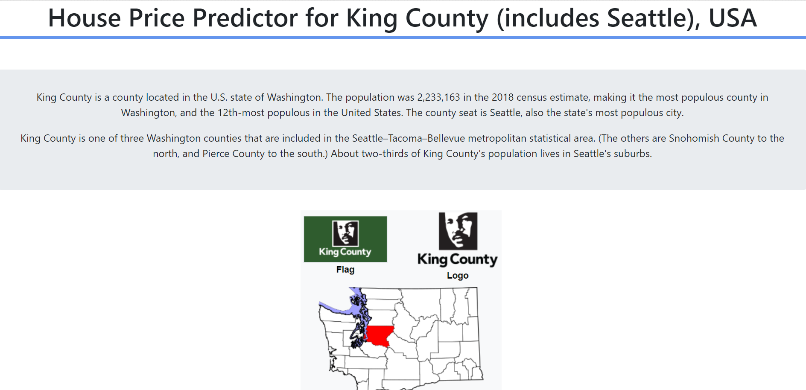

# House Price Predictor Machine Learning Model, comparing *Linear Regression*, *Random Forest Regressor*, and *Gradient Boosting Regressor* method from Sci-kit Learn

This project is about a simple house price predictor, for houses located in King County, USA. Data set was obtained from [*here*](https://www.kaggle.com/harlfoxem/housesalesprediction). It includes homes sold between May 2014 and May 2015.

I'm comparing several method for regression machine learning model, to see which method yield the most accurate output.
It seems **Random Forest Regressor** manages to generate a prediction result closest to the real value, based on its model accuracy score.

For data preprocessing, I removed some outliers (data exist too far away from the mean with low frequency) that available in most columns, resulting in reducing number of records from 21,613 to 19,770 data for accuracy purposes. After that, I visualized the data for EDA mostly using *Tableau 10* and a correlation heat map using *matplotlib* library on Python.

**How to run the program**
1. Clone this repo.
2. Download the additional file (large size), which is an ML model for Random Forest, [*here*](https://drive.google.com/open?id=1W-nXPsn2NeUh7EfOTTl0N5YUUjExmCzw). Place it under the same roof as the other files.
3. Run *backend.py*. Go to link http://localhost:5001 on your browser page.
4. Screenshot of the home page:
    
    
5. Try the *price predictor program*. Fill the form below in the next page:
    
    **Remember!** Try to not fill with number too far from the mean, otherwise the prediction will be far from accurate, since the real data also has several constraints attached to each feature.
6. *Voila!* See your house price prediction!
    
7. Don't forget to check the data visualization I've created.
    
    

### **_Enjoy!_**

#

#### Albertus Rianto Wibisono ✉ _albertusrian95@gmail.com_

[Instagram](https://www.instagram.com/rian__wibisono) | 
[LinkedIn](https://www.linkedin.com/in/albertusrian95/) |
[GitHub](https://www.github.com/RiantoWibisono)
